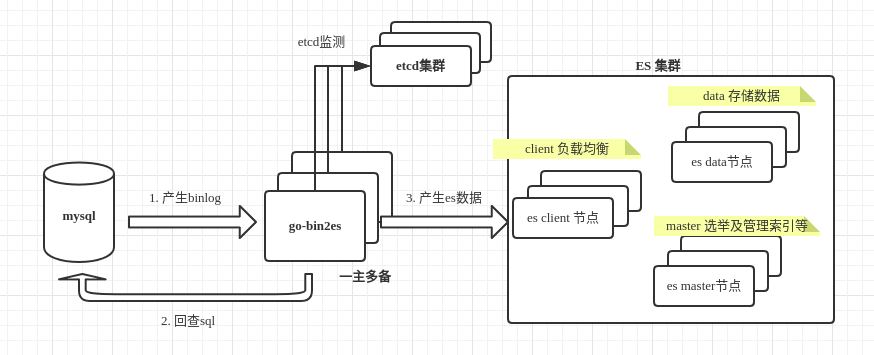

# go-bin2es

go-bin2es is a service syncing binlog to es

## 架构图:


采用了[go-mysql](https://github.com/siddontang/go-mysql)可以过滤指定的db的table, 从而把binlog数据通过[配置的方法](./config/binlog2es.json)过滤后, 刷新到`elasticsearch7`上

## 特点:
+ 支持高版本的elasticsearch7
+ 支持全量, 增量导入数据
+ 应用更加轻量级, 占用较少的内存和cpu
+ 原生支持es的对象、嵌套数组类型
+ 实时性高, 低时延
+ 保证数据最终一致性
+ 基于etcd, 支持一主多备
+ 不支持`delete`操作
+ 支持自定义函数[UserDefinedFunc](https://github.com/HappyJoeJoe/go-bin2es/blob/36d6fd74b7dcfc8cc5c0a304548e45e9836fbec0/bin2es/row_handler.go#L193)去处理es数据, 可扩展更强


# Example
```sql

create database test;

create table Parent (
	id int not null auto_increment primary key,
	name varchar(64) not null,
	sex char(1) not null
)comment = '父';

create table Child (
	id int not null auto_increment primary key,
	name varchar(64) not null,
	sex char(1) not null, 
	parent_id int not null
)comment = '子';

Parent:
insert into Parent (name, sex) values ('Tom', "m"); -- id:1 
Child:
insert into Child (name, sex, parent_id) values ('Tom1', 'm', 1); -- Tom's child1 
insert into Child (name, sex, parent_id) values ('Tom2', 'm', 1); -- Tom's child2 
insert into Child (name, sex, parent_id) values ('Tom3', 'm', 1); -- Tom's child3 

Parent:
insert into Parent (name, sex) values ('Jerry', "m"); -- id:2 
Child:
insert into Child (name, sex, parent_id) values ('Jerry1', 'm', 2); -- Jerry's child1 
insert into Child (name, sex, parent_id) values ('Jerry2', 'f', 2); -- Jerry's child2 
```


### editing your config.toml, and configure it like following:

```toml

[es]
nodes = [
    "http://localhost:9200" #es集群
]
bulk_size = 1024  #批量刷新个数
flush_duration = 500  #批量刷新时间间隔, 单位:ms

[mysql]
addr = "localhost"
port = 3306
user = "bin2es"
pwd = "bin2es"
charset = "utf8mb4"
server_id = 3 #与其他slave节点的server_id不同即可

[master_info]
addr = "localhost"
port = 3306
user = "bin2es"
pwd = "bin2es"
charset = "utf8mb4"
schema = "bin2es"
table = "master_info"
flush_duration = 3  #binlog position 刷新时间间隔, 单位:s

[zk]
enable = false
lock_path = "/go-bin2es-lock"
session_timeout = 1
hosts = [
    "localhost:2181"
]

[etcd]
enable = true
enable_tls = true
lock_path = "/go-bin2es-lock"
dial_timeout = 3
cert_path = "/etc/etcd/etcdSSL/etcd.pem"
key_path = "/etc/etcd/etcdSSL/etcd-key.pem"
ca_path = "/etc/etcd/etcdSSL/ca.pem"
endpoints = [
    "127.0.0.1:2379",
]

[[source]]
schema = "test"
tables = [
    "Parent",
    "Child"
]

```

### editing bin2es.json

```json

[
    {
        "schema":"test",
        "tables":[
            "Parent",
            "Child"
        ],
        "actions":[
            "insert",
            "update"
        ],
        "pipeline":[
            {
                "DoSQL":{
                    "sql":"SELECT Parent.id, Parent.name, Parent.sex, group_concat(concat_ws('_', Child.name, Child.sex) separator ',') as Childs FROM Parent join Child on Parent.id = Child.parent_id WHERE (?) GROUP BY Parent.id",
                    "placeholders":{              #若遇到Parent或Child, 自动将`?`替换为`$key.$value = {该表对应的$value对应的字段的值}`
                        {"Parent":"id"},      #eg: 若遇到Parent, 则`?`被替换为`Parent.id = 行数据对应的`id`字段的值`
                        {"Child":"parent_id"} #eg: 若遇到Child, 则`?`被替换为`Child.parent_id = 行数据对应的`parent_id`字段的值`
                    }
                }
            },
            {
                "Object":{
                    "common":"profile",
                    "fields":[
                        {"name":"es_name"},   #将查询到的结果的`name`字段放进`profile`的`es_name`下
                        {"sex":"es_sex"}      #同理
                    ]
                }
            },
            {
                "NestedArray":{
                    "sql_field":"Childs",     #将查询到的结果的`Childs`字段解析放入到common指定的`childs`下
                    "common":"childs",
                    "pos2fields":[            #其中解析结果的第一个位置放入到es的`es_name`下, 第二个位置放入到`es_sex`下
                        {"es_name":1},
                        {"es_sex":2}
                    ],
                    "fields_seprator": "_",
                    "group_seprator": ","
                }
            },
            {
                "SetDocID": {
                    "_id": "id"
                }
            }
        ],
        "dest":{
            "index":"test_es"                 #es的索引名
        }
    }
]

```

### execute ./bin/go-bin2es
+ then, you will get results in es by using following API: `GET /test_es/_search`

```json

{
    "took": 0,
    "timed_out": false,
    "_shards": {
        "total": 1,
        "successful": 1,
        "skipped": 0,
        "failed": 0
    },
    "hits": {
        "total": {
            "value": 2,
            "relation": "eq"
        },
        "max_score": 1.0,
        "hits": [
            {
                "_index": "test_es",
                "_type": "_doc",
                "_id": "1",
                "_score": 1.0,
                "_source": {
                    "childs": [  #nested array
                        {
                            "chl_name": "Tom1",
                            "chl_sex": "f"
                        },
                        {
                            "chl_name": "Tom2",
                            "chl_sex": "f"
                        },
                        {
                            "chl_name": "Tom3",
                            "chl_sex": "m"
                        }
                    ],
                    "id": "1",
                    "profile": { # object
                        "es_name": "Tom",
                        "es_sex": "m"
                    }
                }
            },
            {
                "_index": "test_es",
                "_type": "_doc",
                "_id": "2",
                "_score": 1.0,
                "_source": {
                    "childs": [  #nested array
                        {
                            "chl_name": "Jerry1",
                            "chl_sex": "m"
                        },
                        {
                            "chl_name": "Jerry2",
                            "chl_sex": "f"
                        }
                    ],
                    "id": "2",
                    "profile": { # object
                        "es_name": "Jerry",
                        "es_sex": "m"
                    }
                }
            }
        ]
    }
}

```

### 如果你觉得对你有用, 可以给我打赏一瓶Colo
